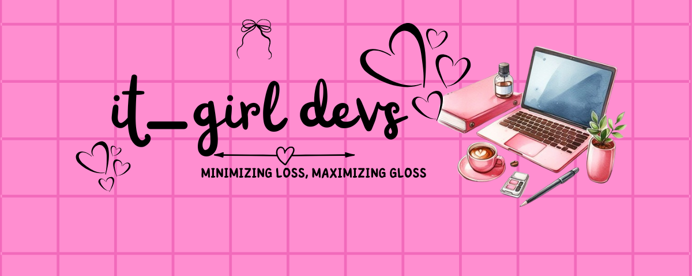

<div align="center">



# 🎀 it-girl devs 🎀

### "Making Machine Learning Aesthetic | The Legally Blonde of Ed-Tech."

[](https://nextjs.org/)
[](https://tailwindcss.com/)
[](https://fastapi.tiangolo.com/)
[](https://supabase.com/)
[](https://deepmind.google/technologies/gemini/)

</div>

---

## ✨ The Vibe

Let's be real: coding documentation usually looks like a sad spreadsheet. **it-girl devs** is here to change the narrative. We are building a coding platform that teaches Machine Learning concepts without the "bro-talk" or the intimidating gray-on-black text. 

We believe that `Linear Regression` is just predicting trends (fashion forecasting?), and `Neural Networks` are just a really complex group chat. We're bringing main character energy to the terminal. 💅

Creatd by **Anjali Sharma**.

---

## 💅 The Fit Check (Tech Stack)

We don't just code; we curate. Here’s what we’re wearing this season:

| Layer | The Piece | The Details |
| :--- | :--- | :--- |
| **Frontend** | **Next.js + Tailwind** | Giving structured, SEO-friendly, but make it cute. |
| **Styling** | **Framer Motion** | Because static websites are *so* last season. Smooth animations only. |
| **Backend** | **FastAPI (Python)** | High performance, typed, and ready to serve data faster than tea. |
| **The Brains** | **Gemini 1.5 Pro** | Powering our "Grade My Vibe" auto-grader. |
| **Database** | **Supabase** | Storing our data securely, because we don't gatekeep, but we do protect. |

---

## ☕ The Tea (Key Features)

*   **📖 Story Mode Modules:** Forget the Iris Flower dataset. We're doing:
    *   *Linear Regression:* "The First Date" (Predicting compatibility scores).
    *   *CNNs:* "Is it a Chihuahua or a Muffin?" (Visual recognition).
*   **🤖 "Grade My Vibe" Auto-Grader:** Powered by Gemini, this isn't your professor's compiler. It reviews your code for accuracy *and* efficiency, delivering feedback with a supportive "bestie" tone.
*   **💖 Aesthetic UI:** Glassmorphism, blurred backdrops, and yes—a fully functional Pink Terminal. 

---

## 💄 Get Ready With Me (Installation)

Want to run this locally? Let's get you set up. Open your terminal (don't worry, it's a safe space).

### 1. Secure the Bag (Clone the Repo)
```bash
# Download the vibes to your local machine
git clone https://github.com/anjalisharma/it-girl-devs.git

# Walk into the room (directory)
cd it-girl-devs
```

### 2. Frontend Skin Care Routine
```bash
# Hydrating the dependencies
npm install

# Start the glow up (development server)
npm run dev
```

### 3. Accessorizing Python (Backend)
```bash
# Put on the virtual environment (it's like a messy bun for your dependencies)
python -m venv venv

# Activate it
# On Windows:
.\venv\Scripts\activate
# On Mac/Linux:
source venv/bin/activate

# Install the essentials
pip install -r requirements.txt

# Serve the API
uvicorn main:app --reload
```

---

## 📅 Roadmap

We are currently in our **Soft Launch** era. Here is what's coming:

- [x] **Season 1: Regression** - Basic ML concepts explained through dating analogies.
- [ ] **Season 2: Deep Learning** - Neural Networks & Computer Vision [Loading...].
- [ ] **The Lookbook:** User profiles to show off your coding streaks and badges.
- [ ] **Group Chat Mode:** Community discussion boards.

---

## 👯‍♀️ Join the Squad (Contributing)

Did you find a bug? (Rude, but helpful). Do you have an idea for a feature that would absolutely *slay*?

1.  Fork the repo (borrow the look).
2.  Create your feature branch (`git checkout -b feature/main-character-energy`).
3.  Commit your changes (`git commit -m 'Added more glitter'`).
4.  Push to the branch (`git push origin feature/main-character-energy`).
5.  Open a Pull Request.

**Note:** Please keep code comments kind and variables descriptive. We don't do `x = 1` here. We do `const numberOfCoffees = 1`.

---

## 📜 License

Distributed under the MIT License. Basically, you can sit with us, use our code, and create cool stuff—just give credit where credit is due! 💖

---

<div align="center">

Made with ☕ and <span style="color: #ff69b4;">♥</span> by Anjali Sharma

</div>
