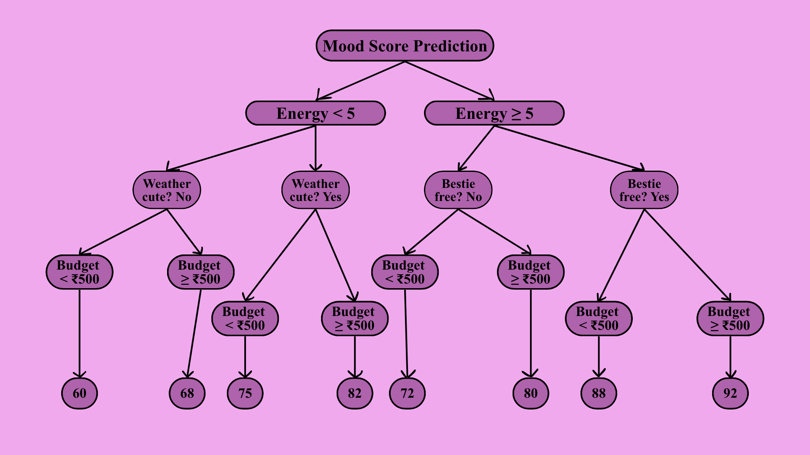
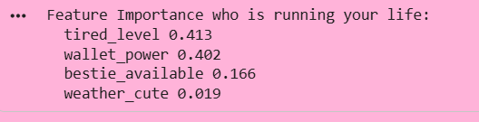
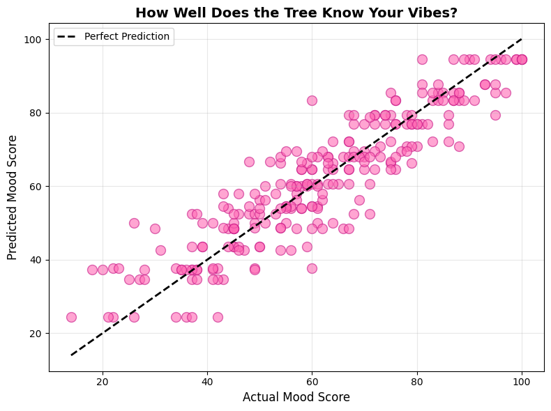
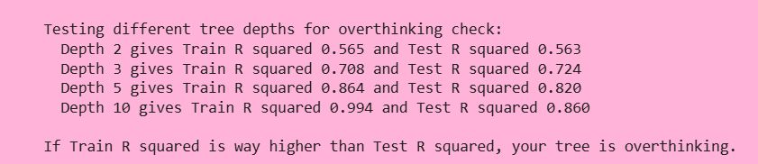

## The episode teaser

Planning the perfect Friday night is literally an art form. You are basically building your own Dream Life OS to figure out exactly what the vibe should be. You have to consider how drained you are after classes, the state of your bank account, if your girls are free, and whether your hair is giving slicked back perfection or needs an everything shower.

You definitely do not want a basic math equation telling you what to do. You need your brain to process everything in a series of specific questions. If you are totally exhausted and your budget is zero, then you and your bestie are staying in with pimple patches and sketching in your journals. That predicts a happiness score of 85.

But if you have high energy and the girls are ready to dress up in matching fits, then you are heading to that cute new rooftop spot for a solid 95. That is what Decision Tree Regression actually does. Instead of drawing straight lines on a graph, it builds a literal flowchart. It splits all your options into cute little groups and predicts the average outcome for each one. It is very much giving ‘let me explain my entire thought process energy’.

## The mood board



Each split is just a new poll in the group chat and the leaf is the final plan we all agree on.

## Decoding the pattern

Let us talk about the actual logic. Decision Tree Regression predicts continuous values. We are not just picking between two basic categories. We are calculating an exact vibe score for your Friday night using a flow of simple yes or no questions.

**The core structure**

Every perfect tree has three main parts to keep the group chat organized.

1. The Root Node. This is the ultimate first question. It is the single most important factor. Are we getting ready to go out or are we doing a cozy night in.
2. The Internal Nodes. These are the follow up questions. Do we have the energy for slicked back hair or are we just securing the claw clips. Did everyone apply their dewy sunscreen.
3. The Leaf Nodes. This is the final prediction.

Imagine you and the girls end up in a specific leaf node. This leaf holds the data from five past Friday nights where you were tired and stayed in with ice rollers. Your happiness scores for those nights were 66, 67, 68, 69, and 70. The model looks at that history, calculates the average, and predicts a solid 68 for tonight. It is just using your past experiences to protect your peace and guarantee a good time for everyone.

**How splits are chosen?**

When making the Friday night plan we want everyone on the exact same wavelength. We want zero chaos. In decision trees this is called minimizing variance. The main goal is to maximize Standard Deviation Reduction.

At every single step the algorithm asks a question. It looks at every possible option. Do we want a late night dark roast coffee run or are we doing face masks. Are we wearing matching sets or just oversized hoodies.

It checks how much the vibe fluctuates after making a decision. It calculates the variance in the new smaller groups. It picks the option that creates the most aligned mood for the girls. The choice with the least amount of mixed feelings wins the split.

Here is the exact formula for Standard Deviation Reduction.

$$
\text{SDR} = \text{SD}(\text{parent}) - \sum \frac{N_{\text{child}}}{N_{\text{parent}}} \times \text{SD}(\text{child})
$$

Let us look at what these letters actually mean for us.

- SD is the standard deviation. This measures the chaos or mixed feelings in our target happiness score.
- N is the total number of girls in the group chat for that specific plan.

The algorithm subtracts the chaos of the new split from the chaos of the original group. The split with the largest reduction in chaos gets to be the next official step in our night. It is literally just math protecting our peace.

**Prediction process**

When a brand new Friday night rolls around, we need a solid plan. We start right at the top with our biggest question. Are we feeling a high energy night out or a lowkey self care evening.

We just answer each question as it comes. Do we have the budget for dinner. Is everyone bringing their lip oils and glosses. We follow the yes or no path down through the group chat until we land in our final designated leaf node. That is our final agreed upon routine.

Once we land in our specific leaf we know exactly what to expect. The model just gives us the average happiness score from the last few times we did this exact same plan.

In the math world, this is called being piecewise constant. It just means your whole universe of choices gets chopped into neat little aesthetic boxes. If you and your girls fall into a specific box, you get that exact same flat prediction every single time. It keeps things so predictable and peaceful.

### Decision trees: Classification vs Regression

Sometimes we want our code to pick a specific aesthetic and sometimes we need exact numbers. Trees can do both but they handle the logic completely differently. Let us look at the two different modes.

Classification Trees are all about sorting things into neat little groups. Are we wearing matching sets or oversized hoodies. Is this message from your bestie or a random guy. It looks at the most popular vote in the group chat to make its final choice. The math focuses on cleaning up messy mixed vibes using a concept called Gini Impurity.

Regression Trees are exactly what we just used for our Friday night plans. They predict a continuous exact number. Instead of picking a category, they calculate the true average of the leaf you land in. The math here is all about reducing pure chaos using Variance.

Here is the exact comparison for your study notes.

- The Final Output
Classification picks a specific category or class label. Regression predicts a continuous number.
- The Splitting Focus
Classification cleans up mixed groups using Gini Impurity or Entropy. Regression reduces chaos using Variance and Standard Deviation.
- The Final Answer
Classification goes with the most popular vote. Regression calculates the exact average.
- The Perfect Example
Classification decides if an email is spam or not. Regression predicts the exact price of a vintage digicam or your exact mood score after an everything shower.

**The good vibes (pros)**

We love an algorithm that communicates clearly. You can literally draw out the whole group chat logic as a cute aesthetic flowchart. It is completely transparent with you and keeps everyone on the same page.

It handles complicated situations naturally. Life is not a perfectly straight line and this algorithm totally gets that. You do not need to force your data to be something it is not. We love accepting our data exactly the way it is.

It mixes all kinds of information flawlessly. Whether you are tracking exactly how much money is in the going out budget or just checking if the girls are free, it takes everything in perfectly.

You do not have to stress about scaling or trying to perfect your numbers before feeding them in. The math just works beautifully on its own.

It automatically catches how different choices support each other. It just knows that staying in with a gua sha and reading a good book is the ultimate healing combination.

**The drama (cons)**

The Overthinking Era. If you let the tree ask way too many questions, it starts memorizing every single tiny detail of your past weekends. It gets stuck on random noise instead of looking at the big beautiful picture.

The Sensitivity. It can be a little unstable. Just changing one minor detail about your data can make the algorithm scrap everything and rewrite the entire plan from scratch.

The Blocky Predictions. You do not get soft smooth curves. Your universe gets chopped into exact boxes. It is a little rigid if you wanted a softer and more flowing vibe for your predictions.

The Immediate Focus. The algorithm can get a bit distracted by instant gratification. It picks the absolute best option for the very next step but sometimes misses out on a much better master plan for the entire night. We always want to protect the peace and secure the absolute best night for the whole group.

**Controlling the overfitting**

To protect the peace and keep our tree from memorizing random noise we have to set some boundaries. We call these hyperparameters. You can adjust them right inside your Pyxie workspace to keep your model completely grounded.

**max_depth**
This controls how deep your overthinking goes. Are we just deciding between a rooftop bar and a cozy night in. Or are we stressing about the exact minute we apply our dewy sunscreen. Keeping the depth shallow gives you a simple and relaxed plan that works for everyone.

**min_samples_split**
This is how much data we need before we complicate things. How many past weekends do we need to look at before we decide to split our logic into a brand new path. It stops the group chat from getting chaotic over just one or two random nights.

**min_samples_leaf**
This is the ultimate vibe check for your final plan. It sets the minimum number of past experiences required for a final decision to be valid. If a specific routine only happened once, we are not making it an official aesthetic yet.

**max_features**
This limits how many details we obsess over at once. Instead of stressing about the budget and the weather and the outfits and the coffee all at the exact same time, we just pick a few key details to focus on for each choice.

The golden rule is simple. Shallow trees give you a flexible plan that always guarantees a good time for the girls. Deep trees just overcomplicate the night and ruin the vibe.

## [The Code](https://colab.research.google.com/drive/1GsGsLUyeM63NIoyirhy2dyQwko5tqycN?usp=sharing)

It is time to make this official. We are going to train our own Decision Tree to predict our exact mood score and secure the perfect plans. We are creating a dataset of past Friday nights. We are tracking our energy levels, checking our budget for matcha and aesthetic dinners, seeing if the girls are free, and checking if the weather is cute enough for taking digicam pictures. Then we split our data to test if our tree actually knows our aesthetic or if she is just memorizing past events. We keep the depth shallow so she does not start overthinking every tiny detail

```python
# Friday night mood forecaster decision tree regression edition

import numpy as np
import pandas as pd
from sklearn.tree import DecisionTreeRegressor, plot_tree
from sklearn.model_selection import train_test_split
from sklearn.metrics import mean_squared_error, r2_score
import matplotlib.pyplot as plt

# Step 1 creating the friday life dataset
# Features are:
# tired_level where 1 is fresh and 10 is exhausted
# wallet_power is money available to go out
# bestie_available where 1 if yes and 0 if no
# weather_cute where 1 if nice weather and 0 if grey

np.random.seed(42)
n_rows = 1000

# generating features
tired_level = np.random.randint(1, 11, n_rows)
wallet_power = np.random.randint(50, 2001, n_rows)
bestie_available = np.random.randint(0, 2, n_rows)
weather_cute = np.random.randint(0, 2, n_rows)

friday_vibes = pd.DataFrame({
    "tired_level": tired_level,
    "wallet_power": wallet_power,
    "bestie_available": bestie_available,
    "weather_cute": weather_cute
})

# target mood score
# logic start at 50 subtract for tired add for money, bestie and weather
mood_score = (
    50 
    - (friday_vibes["tired_level"] * 4)          
    + (friday_vibes["wallet_power"] / 50)        
    + (friday_vibes["bestie_available"] * 15)    
    + (friday_vibes["weather_cute"] * 10)        
)

# clip scores to stay between 0 and 100 and add a bit of random life noise
mood_score = np.clip(mood_score + np.random.normal(0, 5, n_rows), 0, 100).astype(int)

# check the first few rows
print(friday_vibes.head())
print(f"Dataset Size {len(friday_vibes)} rows")

# Step 2 train and test split
vibe_features = friday_vibes
vibe_train, vibe_test, mood_train, mood_test = train_test_split(
    vibe_features,
    mood_score,
    test_size=0.25,
    random_state=42
)

# Step 3 create our decision tree regression queen
# max_depth controls how detailed she gets
mood_oracle = DecisionTreeRegressor(
    max_depth=5,            
    min_samples_leaf=2,     
    min_samples_split=20,
    random_state=42
)

# Step 4 train her on your historical Fridays
mood_oracle.fit(vibe_train, mood_train)

# Step 5 predictions and evaluation
mood_pred_train = mood_oracle.predict(vibe_train)
mood_pred_test = mood_oracle.predict(vibe_test)

mse_train = mean_squared_error(mood_train, mood_pred_train)
mse_test = mean_squared_error(mood_test, mood_pred_test)
r2_test = r2_score(mood_test, mood_pred_test)

print("Friday Night Mood Tree")
print(f"Training MSE {mse_train:.2f}")
print(f"Test MSE {mse_test:.2f}")
print(f"Test R squared Score {r2_test:.3f}\n")

# Step 6 inspect feature importance who matters most
print("Feature Importance who is running your life:")
for name, importance in zip(vibe_features.columns, mood_oracle.feature_importances_):
    print(f"  {name} {importance:.3f}")

# Step 7 visualize the tree the entire decision flowchart
plt.figure(figsize=(14, 8))
plot_tree(
    mood_oracle,
    feature_names=vibe_features.columns,
    filled=True,
    rounded=True,
    fontsize=10
)
plt.title("Friday Night Mood Decision Tree", fontsize=16, fontweight="bold")
plt.tight_layout()
plt.show()

# Step 8 compare actual vs predicted
plt.figure(figsize=(8, 6))
plt.scatter(mood_test, mood_pred_test, color='#FF69B4', s=100, alpha=0.6, edgecolors='#C71585')
plt.plot([mood_test.min(), mood_test.max()], [mood_test.min(), mood_test.max()], 
         'k:', lw=2, label='Perfect prediction')
plt.xlabel('Actual mood score', fontsize=12)
plt.ylabel('Predicted mood score', fontsize=12)
plt.title('How well does the tree know your vibes', fontsize=14, fontweight='bold')
plt.legend()
plt.grid(alpha=0.3)
plt.tight_layout()
plt.show()

# Step 9 let the model plan your next Friday
# scenario moderately tired, decent budget, bestie free, weather is cute
future_friday = pd.DataFrame({
    "tired_level":      [6],
    "wallet_power":     [700],
    "bestie_available": [1],
    "weather_cute":     [1]
})

future_mood = mood_oracle.predict(future_friday)[0]
print(f"\nPrediction for your next friday:")
print(f"   Tired 6 out of 10 | Budget 700 | Bestie Yes | Weather Cute")
print(f"   Expected mood score {future_mood:.1f} out of 100")

if future_mood >= 80:
    print("   Verdict ICONIC. Go out and serve looks.")
elif future_mood >= 60:
    print("   Verdict Decent vibes. Maybe a cozy cafe.")
else:
    print("   Verdict Stay home babe. Self care era.")

# Step 10 test different depths to show overthinking drama
print("\nTesting different tree depths for overthinking check:")
for depth in [2, 3, 5, 10]:
    temp_tree = DecisionTreeRegressor(max_depth=depth, random_state=42)
    temp_tree.fit(vibe_train, mood_train)
    train_r2 = r2_score(mood_train, temp_tree.predict(vibe_train))
    test_r2 = r2_score(mood_test, temp_tree.predict(vibe_test))
    print(f"  Depth {depth} gives Train R squared {train_r2:.3f} and Test R squared {test_r2:.3f}")
    
print("\nIf Train R squared is way higher than Test R squared, your tree is overthinking.")
```

### What's happening here?

Let us look at what is actually running your life. The code spits out the feature importance and it is honestly so validating. Your energy level and your budget are taking up roughly 80% of the decision making power. Having your bestie available definitely saves the mood but whether the weather is cute or not barely even registers. The algorithm knows that if you are completely drained a sunny day is simply not going to fix the vibe.



Then we get the visual representation of how well the model knows you. Look at the dotted black line in the scatter plot as absolute perfection. If every single pink dot landed exactly on that line it would mean your algorithm can read your mind flawlessly. Our dots are clustering really nicely around the line which means the tree genuinely understands your aesthetic and predicts a solid night out. There is a little bit of spread because life is naturally unpredictable. Sometimes a fresh set of nails or an impromptu matcha run shifts the mood and you just have to account for that natural chaos.



Finally we have the overthinking check. Look at what happens when we set the depth to ten. The training score is practically perfect at 99%. The tree literally memorized every single tiny detail of your past weekends. But when we test it on brand new plans, the score completely drops. That is pure overfitting. It is overcomplicating things for absolutely no reason. It is stressing over a complicated slicked back hair routine when a simple claw clip would have given you the exact same clean girl aesthetic. Keeping the depth around five gives you a solid and reliable plan without completely ruining the peace of the group chat.



## Mini-Project: "The Everything Shower Time Predictor"

**Mission:** Build a Decision Tree Regression model entirely from scratch. You will predict exactly how many minutes an everything shower will take depending on specific mood and routine inputs.

**The data inputs**
You will create a custom dataset with at least five hundred rows. Here are the exact inputs you need to track.

- Stress Level. Rate it 1 to 10. 10 means you desperately need to romanticize your life.
- Hair Wash Day. 1 for yes and 0 for no.
- Shaving Required. 1 for yes and 0 for no.
- New Products Waiting. Do you have a brand new body scrub or hair mask to try. 1 for yes and 0 for no.

Generate your dataset using random numbers just like we did for the Friday night code. Make sure the logic is realistic. A hair wash day should add at least fifteen minutes.

**The target**
Total Shower Minutes. This is your continuous prediction. The base time is 20 minutes but it increases drastically when the other inputs are involved.