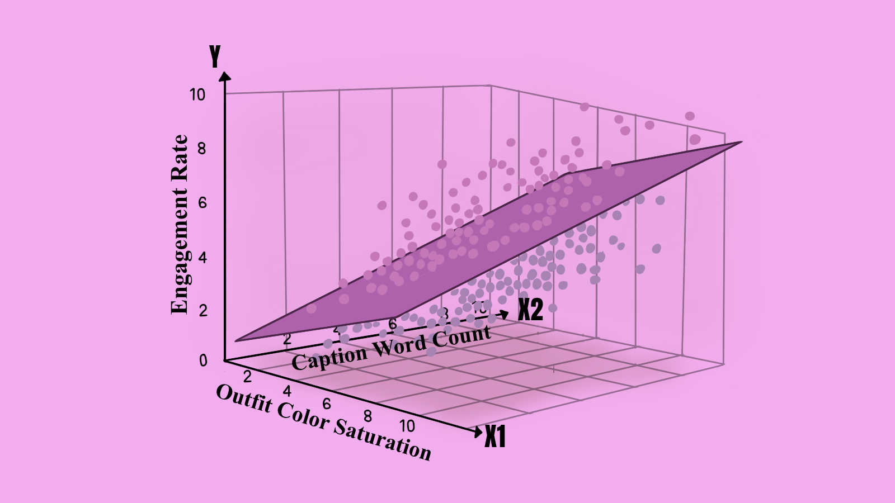
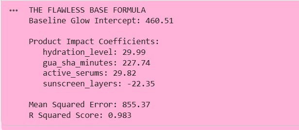
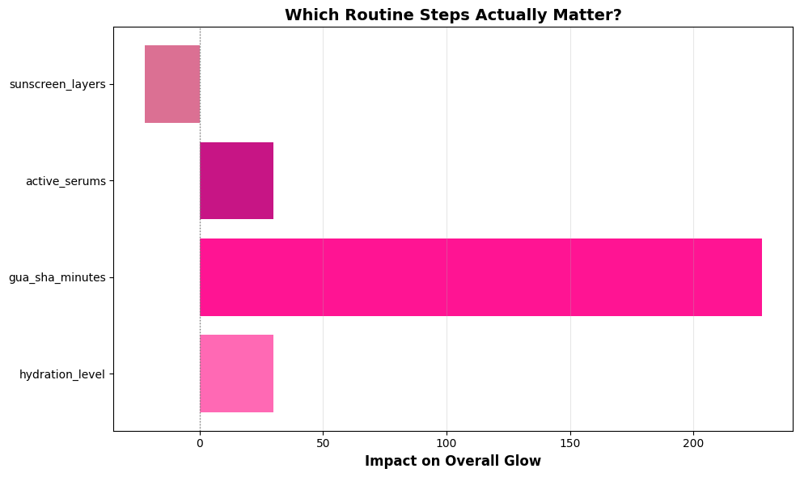
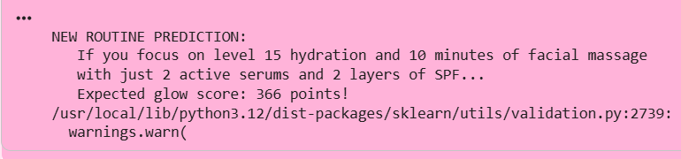
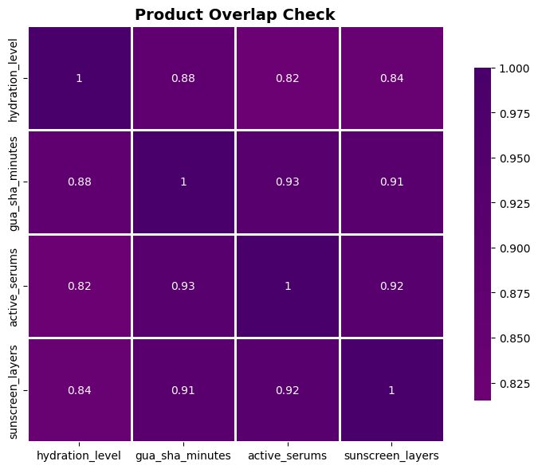
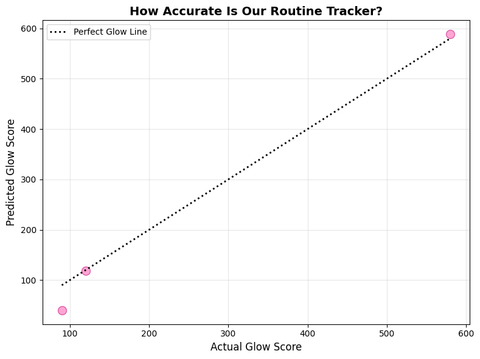

## The episode teaser

Plot twist: getting that perfect dewy glass skin does not just happen from drinking water. We all know the drill. That flawless base actually depends on so many different steps. It is about using a gentle cleanser. It is applying hydrating serums on damp skin. It is whether you used your ice roller this morning and locked it all in with the right dewy sunscreen. Your glow is a combination of all those things working together perfectly. Welcome to Multiple Linear Regression. It is the upgraded version of our basic math girl. She finally gets that you have a whole routine and your final result depends on multiple different variables.

We are officially moving past asking if just variable $X$ gives you a glow. Now we are asking how $X_1$, $X_2$, $X_3$, and $X_4$ all work together to create your final look. This is the math we use when we realize a flawless base is an entire ecosystem. We love to see everyone glowing and we know it takes a complete routine to get there. You are going from asking if one simple moisturizer is good to tracking your active ingredients, your application order, and exactly how long you wait between layers. Let us get into the multivariate details.

## The mood board



We went from 2D to 3D because you're too complex for just one variable.

## Decoding the pattern

Multiple Linear Regression is literally just Simple Linear Regression that finally invested in a proper skincare system and learned to handle actual complexity. Instead of relying on just one basic moisturizer as your only feature, you now have an entire routine. You have your clearing serums, your barrier creams, and your dewy sunscreen. All of these multiple features are working together to contribute to your final flawless prediction.

The math literally got an upgrade. We went from our basic era equation like this:

$$
y = β_1 x + β_0
$$

To this fully stacked routine:

$$
y = β_0 + β_1 x_1 + β_2 x_2 + β_3 x_3 + ... + β_n x_n
$$

Or in matrix form because we love an organized vanity cabinet:

$$
y=Xβ+ϵ
$$

Let us break down the ingredients list.

- *y* is your predicted outcome (your final glass skin result).
- *x*₁, *x*₂, *x*₃... are your actual routine steps. Your hydrating toner, your Vitamin C, and your daily SPF.
- *β*₁, *β*₂, *β*₃... are the coefficients. This is how hard each product is actually working. Some steps carry the whole routine and some just add a cute little bonus glow.
- *β*₀ is the intercept. This is your baseline skin status when you wake up and do absolutely nothing. You are already gorgeous and this is just your starting canvas.
- *ϵ* is the error term. These are the random hormonal breakouts or weather changes we literally cannot predict. Life happens to all of us and that is completely okay.

### The math behind finding the perfect ratio

We are still trying to minimize our Mean Squared Error. This error is the difference between the flawless base we actually want and what we end up with if our routine is unbalanced. Since we are layering multiple active ingredients now, the math has to juggle it all. Here is what that cost function looks like:

$$
MSE = \frac{1}{n} \sum_{i=1}^{n} (y_i - \hat{y}_i)^2
$$

Where your predicted glow is calculated like this:

$$
\hat{y}_i = β_0 + β_1x_i1 + β_2x_i2 + ... + β_nx_in
$$

To find the exact right amount of each product to use, the algorithm uses something called the Normal Equation. It gives us the direct answer in matrix form:

$$
β=(X^TX)^{-1}X^Ty
$$

Do not let the matrix math stress you out at all. Python libraries like *sklearn* completely handle this part for us behind the scenes. We love a tool that does the heavy lifting for us. Basically, it is just the algorithm figuring out the exact perfect combination of your serums and creams that minimizes any chance of a bad skin day. It is finding the ultimate routine with zero regrets.

### New metrics you need to know

1. **Adjusted R²**: Adjusted R² is the real one. Regular R² can be a bit of a fake friend because it will increase every time you add a new product to your shelf, even if it does absolutely nothing for your skin. Adjusted R² is your honest bestie who tells you if that extra step is actually helping your glow or just wasting your time. It is all about quality over quantity.
2. **Multicollinearity**: Multicollinearity is basically the drama that happens when you have two products that do the exact same thing. Like using a hydrating serum and then a hydrating essence that both have the same main ingredient. It just confuses your routine and the model. We check for this using the Variance Inflation Factor or VIF. If that score is over 10 then one of those features is redundant and we should probably let it go.
3. **Feature Importance**: Feature Importance helps us find the holy grail products on our vanity. The coefficients show us exactly which steps are doing the heavy lifting for your results. A coefficient of 5.2 means that for every one unit increase in that specific step your glow increases by 5.2 points while everything else stays the same. It helps us see what is truly making the biggest difference in the ecosystem.

### The assumptions (Yes, she still has standards)

Even though we upgraded to a full routine, our skin still has boundaries. We cannot just throw everything at our face and hope it works. There are rules to keep your barrier intact and glowing.

- **No multicollinearity:** Your products should not be identical twins. You do not need a liquid salicylic acid and a gel salicylic acid in the exact same routine. They do the exact same thing. Layering them just irritates your face and makes it impossible to tell which one is actually working. Every step needs its own unique job.
- **Linear relationship:** Every product should have a direct and clear relationship with your final glow. If you apply a pump of hydration, you get a direct boost in your skin plumpness. It is a straight path to your desired results. We will talk about what happens when too much of a good thing actually ruins your base when we get to our advanced polynomial routine later.

## [The Code](https://colab.research.google.com/drive/1VkxlwKUh6JsbQ5m9ohbeYJncpr2pyJI1?usp=sharing)

Now we are putting our entire morning routine into Python. Every girl has a totally unique and beautiful base and we love seeing everyone find what works for them.

This code is how we figure out exactly which steps in our routine are giving us that glass skin glow and which ones we can probably skip.

We are tracking our hydration levels, our gua sha massage minutes, the number of active serums we use, and our daily sunscreen layers. Balance is everything.

```python
# Predicting our flawless base with multiple factors
# Because a one product routine just does not work for our complex skin

import numpy as np
import pandas as pd
import matplotlib.pyplot as plt
from sklearn.linear_model import LinearRegression
from sklearn.model_selection import train_test_split
from sklearn.metrics import mean_squared_error, r2_score
from sklearn.preprocessing import StandardScaler
import seaborn as sns

# Our comprehensive routine data
# We are tracking everything to find our perfect balance
data = {
    'hydration_level': [9, 12, 15, 18, 21, 10, 14, 19, 22, 8, 13, 17, 20, 11, 16],
    'gua_sha_minutes': [5, 12, 8, 20, 15, 6, 9, 18, 16, 4, 10, 14, 17, 7, 11],
    'active_serums': [2, 4, 3, 5, 4, 2, 3, 5, 4, 1, 2, 4, 5, 3, 3],
    'sunscreen_layers': [1, 3, 2, 3, 3, 1, 2, 3, 3, 1, 2, 3, 3, 2, 2],  
    'glow_score': [120, 450, 280, 890, 650, 180, 320, 780, 720, 90, 380, 580, 850, 240, 420]
}

df = pd.DataFrame(data)

# Separating our steps from our final glowing result
feature_names = ['hydration_level', 'gua_sha_minutes', 'active_serums', 'sunscreen_layers']
routine_steps = df[feature_names]  
final_glow = df['glow_score'] 

# Standardizing our routine so one product does not overpower the rest
# We want all our ingredients to play nicely together
scaler = StandardScaler()
routine_steps_scaled = scaler.fit_transform(routine_steps)

# Splitting our data to test if the routine actually works
# 80 percent for training and 20 percent to verify our results
X_train, X_test, y_train, y_test = train_test_split(
    routine_steps_scaled, 
    final_glow, 
    test_size=0.2, 
    random_state=42
)

# Creating our routine prediction model
glow_oracle = LinearRegression()

# Training the model on our daily habits
glow_oracle.fit(X_train, y_train)

# Making predictions on our test days
predicted_glow = glow_oracle.predict(X_test)

# Evaluating how well our routine is working
mse = mean_squared_error(y_test, predicted_glow)
r2 = r2_score(y_test, predicted_glow)

print("THE FLAWLESS BASE FORMULA")
print(f"Baseline Glow Intercept: {glow_oracle.intercept_:.2f}")
print("\nProduct Impact Coefficients:")
for feature, coef in zip(feature_names, glow_oracle.coef_):
    print(f"   {feature}: {coef:.2f}")

print(f"\nMean Squared Error: {mse:.2f}")
print(f"R Squared Score: {r2:.3f}")

# Visualizing which steps actually matter
# Aesthetic pink bar chart incoming
plt.figure(figsize=(10, 6))
colors = ['#FF69B4', '#FF1493', '#C71585', '#DB7093']
plt.barh(feature_names, glow_oracle.coef_, color=colors)
plt.xlabel('Impact on Overall Glow', fontsize=12, fontweight='bold')
plt.title('Which Routine Steps Actually Matter?', fontsize=14, fontweight='bold')
plt.axvline(x=0, color='gray', linestyle='dotted', linewidth=1)
plt.grid(axis='x', alpha=0.3)
plt.tight_layout()
plt.show()

# Predicting a brand new routine performance
# Scenario: Hydration level 15, 10 minutes of gua sha, 2 serums, and 2 sunscreen layers
new_routine = np.array([[15, 10, 2, 2]])
new_routine_scaled = scaler.transform(new_routine)
predicted_results = glow_oracle.predict(new_routine_scaled)

print(f"\nNEW ROUTINE PREDICTION:")
print(f"   If you focus on level 15 hydration and 10 minutes of facial massage")
print(f"   with just 2 active serums and 2 layers of SPF...")
print(f"   Expected glow score: {predicted_results[0]:.0f} points!")

# Checking for redundant products so we do not damage our skin barrier
plt.figure(figsize=(8, 6))
correlation_matrix = df[feature_names].corr()
sns.heatmap(correlation_matrix, annot=True, cmap='RdPu', center=0, 
            square=True, linewidths=1, cbar_kws={"shrink": 0.8})
plt.title('Product Overlap Check', fontsize=14, fontweight='bold')
plt.tight_layout()
plt.show()

# Actual glow vs predicted glow scatter plot
plt.figure(figsize=(8, 6))
plt.scatter(y_test, predicted_glow, color='#FF69B4', s=100, alpha=0.6, edgecolors='#C71585')
plt.plot([y_test.min(), y_test.max()], [y_test.min(), y_test.max()], 
         color='black', linestyle='dotted', lw=2, label='Perfect Glow Line')
plt.xlabel('Actual Glow Score', fontsize=12)
plt.ylabel('Predicted Glow Score', fontsize=12)
plt.title('How Accurate Is Our Routine Tracker?', fontsize=14, fontweight='bold')
plt.legend()
plt.grid(alpha=0.3)
plt.tight_layout()
plt.show()
```

### What’s happening here?

We just ran the numbers on our morning routine and the results are officially in. Let us look at exactly what the math told us about achieving that flawless base.

**The holy grail and the flops**

Look at the printout and the bar chart. Your baseline glow is sitting at a gorgeous 460 points. That is you waking up and doing absolutely nothing. You are already winning.



But look at the product impact. Your gua sha massage is carrying the entire routine. With a massive score of 227 it is the absolute main character of your morning. Your hydration level and active serums are giving a cute little boost of about 29 points each.



The plot twist? The sunscreen layers have a negative score of 22. We are absolutely never skipping SPF but the math says layering it too thick is ruining your immediate dewy finish. It is probably pilling or giving a white cast. Quality over quantity always.

**The prediction check**

We tested a totally new scenario. We asked the model what happens with level 15 hydration and 10 minutes of facial massage. It predicted a solid 366 glow score. 



There is a little warning message there too but do not stress. That is just Python being a protective bestie reminding us that we passed raw numbers without the official column names. The math still works perfectly.

**The routine overlap**

Now look at the purple squares here. This is where we catch the routine overlap. See those super high numbers like 0.93 between your active serums and your gua sha minutes?



That means whenever you do your facial massage, you are almost always using your active serums at the exact same time. Because they always happen together the math gets a little confused about which one is doing the real work. Your routine needs better boundaries so each step can get the credit it deserves.

Finally check the scatter plot. Those pink dots are hugging that dotted line like their life depends on it.



Our R² score was 0.983 which means our formula is incredibly accurate. When the model predicts a certain level of glass skin you are guaranteed to walk out the door looking exactly that flawless.

## Mini-Project: "The Salary Prediction System"

**Your Mission:** You are sitting at the negotiation table with top tech companies. You need to know your exact worth and back it up with data. Build a model to predict your starting salary based on your entire profile instead of just one single skill.

**Dataset:  [Get That Bag: Tech Salary Predictor](https://www.kaggle.com/datasets/anjaliisharmaa/get-that-bag-tech-salary-predictor)** (Or you can just use **pd.read_csv('salary.csv')** and let Pyxie load it for you right here!)

**Goal:**

1. Build a multiple linear regression model
2. Identify which factor has the BIGGEST impact on salary
3. Predict YOUR expected salary based on your real stats

**Deliverable:** A clean Python script with your model metrics..

**Bonus Challenge:** Check for overlapping variables and drop the redundant ones so your model stays perfectly balanced. If you get stuck just check the discussion tab in the dataset for a little help.