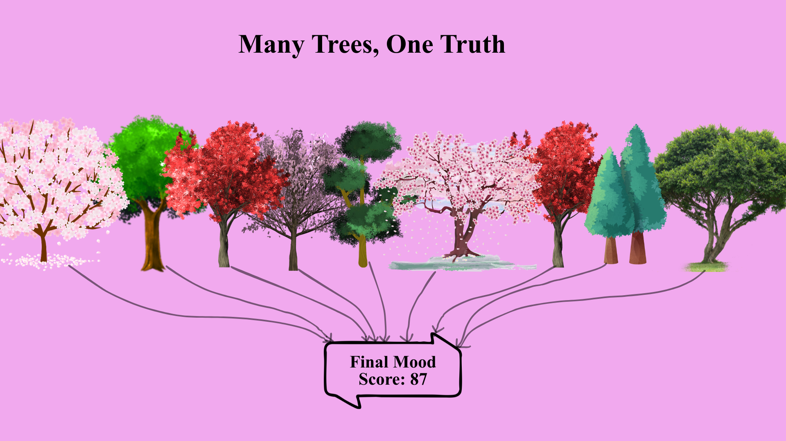
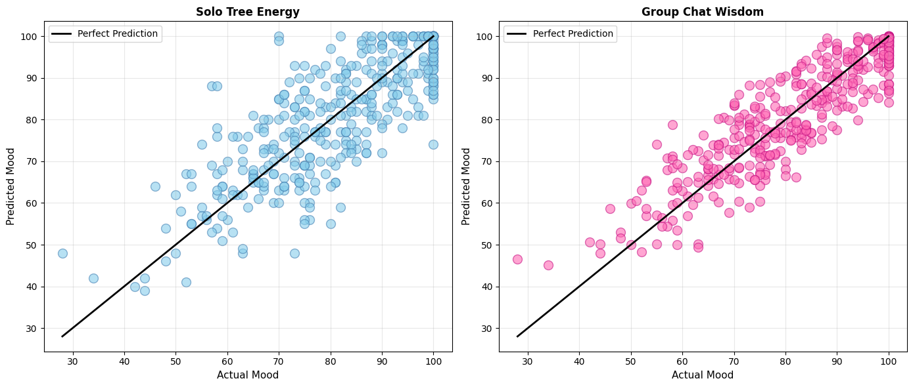
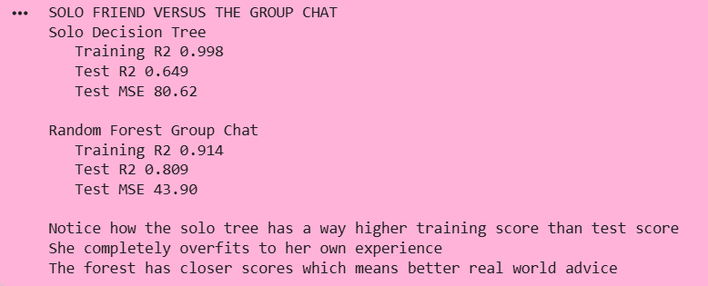
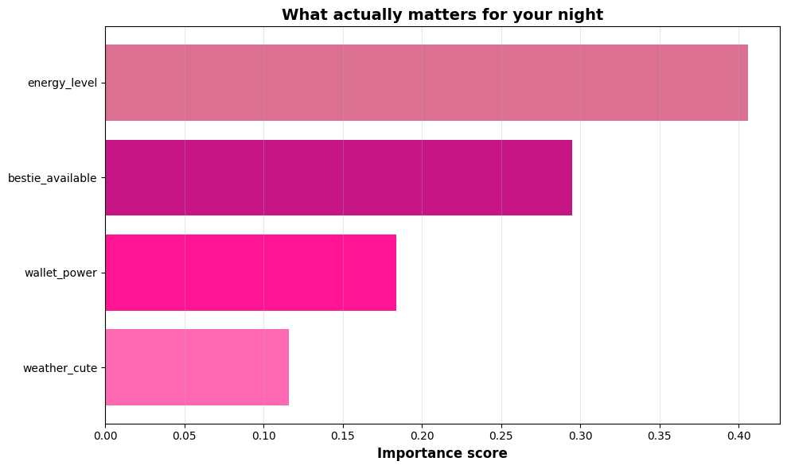
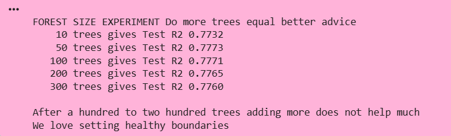

## The episode teaser

You know when you ask just one person for a dewy sunscreen recommendation and they swear by a product that leaves a terrible chalky layer. It happens to the best of us. Trusting a single source can sometimes lead you astray.

Now imagine you drop the question into a massive group chat of girls who just get it. There are a hundred of them. Each friend only tests the sunscreen under different specific conditions so everyone has a unique perspective.

One friend wears it while running errands. Another tries it while romanticizing her morning clay sculpting session. Another wears it out on campus with her slicked back hair and claw clip.

They all give their rating out of ten. You take the average of all their scores. Suddenly you are getting the absolute best advice because all the random chaos balances out and the actual truth emerges.

That is Random Forest Regression. It is not just one decision tree making predictions. It is an entire forest of trees that each look at slightly different pieces of your data and then they all decide together.

## The mood board



She's not just one opinion, she's the collective wisdom of the entire forest

## Decoding the pattern

The actual science behind this is called an ensemble method. Instead of relying on just one girl who might have a very specific skin type to make the call, we gather the whole squad.

Every single friend acts as her own decision tree. She tests the product, weighs the pros and cons, and gives it a final score.

When you combine all these different opinions, the final rating becomes incredibly reliable. If one girl had a bad skin day and rated it poorly, the other 99 glowing reviews will balance it out.

By averaging everyone's input, the algorithm gives you a really solid prediction. It is just girls supporting girls to make sure nobody walks out with a white cast.

**The core algorithm: Bagging + Randomness**

The secret behind the group chat success is mixing things up so nobody is copying each other.

First we do something called Bootstrap Sampling. For every friend in the chat we give them a slightly different set of test days. We pick random days from your month. Sometimes the same everything shower day gets picked twice and some chill reading days get skipped entirely. This makes sure every single girl has her own unique experience to base her review on.

Next is Random Feature Selection which is the real magic. When each friend is deciding her rating she is not allowed to look at every single detail. We give her a random smaller list of things to care about.

If there are twenty things to judge like price or texture or how it looks with your minimalistic jewellery, she only gets to look at maybe five of them. This stops everyone from just obsessing over one obvious thing like a viral brand name. If a girl does not even know the brand, she is forced to pay attention to how the formula actually feels.

Then we let them Grow Deep Trees. We let every friend go as deep into her thoughts as she wants. She can completely overthink her specific list of features just like that one friend who overanalyzes every single text message. On her own she might be overcomplicating things but that is completely fine because the group always balances her out.

Finally we Aggregate Predictions. When you need to make a final choice you ask the whole chat. Every girl gives her final score. Since we are doing regression which means predicting a number, we just find the average of all their scores.

$$
\displaystyle \hat{y}_{\text{forest}} = \frac{1}{B} \sum_{b=1}^{B} \hat{y}_b
$$

Here B is the total number of girls in the chat and the y variable is the score from each friend. If we were trying to just say yes or no to buying the product, we would take a majority vote instead. But for a specific rating we stick to the beautiful average.

**Why this is genius**

Relying on just one decision tree is like trusting that one friend who tried a bad vitamin C serum once and now believes all active ingredients will ruin your skin. Her opinion swings wildly based on one single bad experience. If one tiny detail changes, her entire perspective flips completely. She memorizes every little quirk of her own routine and refuses to see the broader truth. She completely overfits to her own daily life.

The random forest solution is turning to your supportive group chat. Everyone brings a completely diverse perspective based on their own unique skin journeys. Because you average all their thoughts, the wild individual takes get smoothed out. You get a beautifully balanced and reliable answer.

This method is incredibly strong against random noise and weird outliers. If one girl had a random breakout from a totally normal ingredient, it only affects her single vote. The rest of the girls keep the final rating accurate. The little mistakes from different girls cancel each other out naturally. As long as everyone is making their own choices and not just blindly copying the exact same influencer, you get the absolute best advice every single time.

**Feature Importance: Who's actually running your life?**

The random forest can actually tell you which specific detail is doing the heavy lifting in your routine. It tracks exactly how much each little thing clears up the confusion across every single review from the girls. This process measures how much a specific step like using an ice roller or applying a glossy lip oil helps everyone reach a clear and solid decision. We average this helpfulness score across the entire group chat. The details with the highest importance scores are the ones that constantly predict a good outcome, no matter what else is going on. It is like finally realizing that romanticizing your morning by working with clay and having a dark roast espresso sets your mood up for success way more than having perfect weather on campus. You only figure that absolute truth out after the girls analyze a hundred different daily routines. Random forests can tell you which features matter most by tracking how much each feature reduces variance across all splits in all trees.

**When your bestie squad thrives**

The absolute best part of having a massive group chat is how she handles the drama. Even if one friend is spiraling and overthinking a single text, the entire squad keeps things perfectly grounded.

She is completely unbothered by random weird moments. If one girl had a wild allergic reaction to a perfectly good lip gloss, the rest of the chat will not let that ruin the product for you.

You do not even need to organize your thoughts before asking for advice. There is no need to prep or perfectly aestheticize your data. If you drop a messy paragraph with missing details about your campus life, she still understands exactly what you mean.

She can process so much information at once. You can throw hundreds of details at her from your digicam photos to your reading list and she will not get confused.

She tells you exactly what actually matters so you stop worrying about the wrong things. Plus she is incredibly versatile. She can help you rate a new routine out of ten or just give you a simple yes or no answer.

**When she gets overwhelmed**

Of course relying on a huge group chat has some downsides. Waiting for a hundred girls to reply takes a lot more time and energy than just texting your one solo friend.

It is also way harder to explain how you reached your final choice. You cannot just draw a simple chart or point to one single text message. The answer is scattered across hundreds of different voice notes.

She can still get carried away if you give her too little information. If you only show her a few days of your life and let her overanalyze them, the advice will still miss the mark.

Asking for a fresh opinion is always extra work because you have to run your new situation past every single person in the chat all over again.

Finally she really struggles to imagine things outside her own reality. If you ask for advice on a completely new aesthetic that nobody in the chat has ever tried before, she will just average out her past experiences instead of giving you a truly new perspective.

**Setting the boundaries for your squad**

Just like every supportive chat needs some unspoken rules, your random forest needs boundaries so things do not spiral out of control. These are the settings you tweak to get the perfect results.

- First is **n_estimators** which is literally just how many friends you invite to the chat. Having more friends gives you better advice but adding more than two hundred girls just drains your phone battery without really changing the final verdict.
- Next is **max_feature**s which limits how much drama you drop at once. Instead of letting them judge your entire routine, you only let them look at a few details at a time. This keeps them focused.
- Then we have **max_depth** which controls how intense the overthinking gets. If you leave it unlimited, the girls will analyze every tiny detail until the early morning. Usually letting them go as deep as they want is totally fine but sometimes you need to cut the conversation short.
- For **min_samples_split** you are basically setting a minimum requirement for recognizing a pattern. It decides how many times a situation has to happen before your friends are allowed to draw a new conclusion. You cannot just declare a new beauty rule after trying a product only twice.
- Finally **min_samples_leaf** makes sure nobody is giving highly specific advice based on one weird isolated incident. It requires a minimum number of similar experiences to back up a final opinion so you do not end up with completely chaotic suggestions.

## [The Code](https://colab.research.google.com/drive/1c7jmTD7Z8KPY1AIu1GGvXuicc1GMXka1?usp=sharing)

Let us put all this theory into action. We are building the ultimate Friday planning algorithm. We are officially swapping out that one overthinking friend for a fully supportive group chat of decision trees.

```python
# The friday night oracle forest
# because one single opinion is chaos but a hundred trees bring pure wisdom

import numpy as np
import pandas as pd
from sklearn.ensemble import RandomForestRegressor
from sklearn.tree import DecisionTreeRegressor
from sklearn.model_selection import train_test_split
from sklearn.metrics import mean_squared_error, r2_score
import matplotlib.pyplot as plt

# Step 1 create the ultimate friday dataset
# features
# energy_level 1 is absolute exhaustion 10 is fresh out of an everything shower
# wallet_power shopping budget available for the night
# bestie_available 1 if she is ready 0 if she is busy
# weather_cute 1 if it is a good hair day 0 if it is raining

np.random.seed(42)
n_rows = 2000

energy_level = np.random.randint(1, 11, n_rows)
wallet_power = np.random.randint(50, 3001, n_rows)
bestie_available = np.random.randint(0, 2, n_rows)
weather_cute = np.random.randint(0, 2, n_rows)

friday_plans = pd.DataFrame({
    "energy_level": energy_level,
    "wallet_power": wallet_power,
    "bestie_available": bestie_available,
    "weather_cute": weather_cute
})

# target is mood score out of 100
# random forests love complex situations so we use some math here
mood_score = (
    15
    + (friday_plans["energy_level"] * 3.5)
    + (np.log1p(friday_plans["wallet_power"]) * 5)
    + (friday_plans["bestie_available"] * 18)
    + (friday_plans["weather_cute"] * 12)
)

# adding some random life chaos noise
mood_score = np.clip(mood_score + np.random.normal(0, 7, n_rows), 0, 100).astype(int)

print(f"Dataset size {len(friday_plans)} rows")
print(friday_plans.head())

# Step 2 keep the receipts on unseen fridays
features_train, features_test, mood_train, mood_test = train_test_split(
    friday_plans,
    mood_score,
    test_size=0.2,
    random_state=42
)

# Step 3 build the models

# The solo overconfident friend who definitely overthinks
solo_tree = DecisionTreeRegressor(random_state=42)
solo_tree.fit(features_train, mood_train)

# the supportive group chat energy with a hundred trees
forest_oracle = RandomForestRegressor(
    n_estimators=100,
    max_features='sqrt',
    min_samples_leaf=2,
    random_state=42
)
forest_oracle.fit(features_train, mood_train)

# Step 4 get advice from both
solo_pred_train = solo_tree.predict(features_train)
solo_pred_test = solo_tree.predict(features_test)

forest_pred_train = forest_oracle.predict(features_train)
forest_pred_test = forest_oracle.predict(features_test)

# Step 5 compare the drama
print("SOLO FRIEND VERSUS THE GROUP CHAT")

print("Solo Decision Tree")
print(f"   Training R2 {r2_score(mood_train, solo_pred_train):.3f}")
print(f"   Test R2 {r2_score(mood_test, solo_pred_test):.3f}")
print(f"   Test MSE {mean_squared_error(mood_test, solo_pred_test):.2f}")

print("\nRandom Forest Group Chat")
print(f"   Training R2 {r2_score(mood_train, forest_pred_train):.3f}")
print(f"   Test R2 {r2_score(mood_test, forest_pred_test):.3f}")
print(f"   Test MSE {mean_squared_error(mood_test, forest_pred_test):.2f}")

print("\nNotice how the solo tree has a way higher training score than test score")
print("She completely overfits to her own experience")
print("The forest has closer scores which means better real world advice")

# Step 6 feature importance
importances = forest_oracle.feature_importances_
feature_names = friday_plans.columns

print("\nFEATURE IMPORTANCE Who is actually running your life")
importance_df = pd.DataFrame({
    'feature': feature_names,
    'importance': importances
}).sort_values('importance', ascending=False)

for idx, row in importance_df.iterrows():
    bar = '█' * int(row['importance'] * 50)
    print(f"   {row['feature']:20s} {bar} {row['importance']:.3f}")

# Step 7 visualize feature importance
plt.figure(figsize=(10, 6))
colors = ['#FF69B4', '#FF1493', '#C71585', '#DB7093']
importance_df_sorted = importance_df.sort_values('importance')
plt.barh(importance_df_sorted['feature'], importance_df_sorted['importance'], color=colors)
plt.xlabel('Importance score', fontsize=12, fontweight='bold')
plt.title('What actually matters for your night', fontsize=14, fontweight='bold')
plt.grid(axis='x', alpha=0.3)
plt.tight_layout()
plt.show()

# Step 8 actual vs predicted comparison
fig, axes = plt.subplots(1, 2, figsize=(14, 6))

# solo tree
axes[0].scatter(mood_test, solo_pred_test, color='#87CEEB', s=100, alpha=0.6, edgecolors='#4682B4')
axes[0].plot([mood_test.min(), mood_test.max()], [mood_test.min(), mood_test.max()],
             'k', lw=2, label='Perfect Prediction')
axes[0].set_xlabel('Actual Mood', fontsize=11)
axes[0].set_ylabel('Predicted Mood', fontsize=11)
axes[0].set_title('Solo Tree Energy', fontsize=12, fontweight='bold')
axes[0].legend()
axes[0].grid(alpha=0.3)

# random forest
axes[1].scatter(mood_test, forest_pred_test, color='#FF69B4', s=100, alpha=0.6, edgecolors='#C71585')
axes[1].plot([mood_test.min(), mood_test.max()], [mood_test.min(), mood_test.max()],
             'k', lw=2, label='Perfect Prediction')
axes[1].set_xlabel('Actual Mood', fontsize=11)
axes[1].set_ylabel('Predicted Mood', fontsize=11)
axes[1].set_title('Group Chat Wisdom', fontsize=12, fontweight='bold')
axes[1].legend()
axes[1].grid(alpha=0.3)

plt.tight_layout()
plt.show()

# step 9 predict your next Friday
future_friday = pd.DataFrame({
    "energy_level":     [8],
    "wallet_power":     [850],
    "bestie_available": [1],
    "weather_cute":     [1]
})

forest_prediction = forest_oracle.predict(future_friday)[0]
solo_prediction = solo_tree.predict(future_friday)[0]

print(f"\nNEXT FRIDAY PREDICTION")
print(f"   Setup Energy 8 out of 10 Budget 850 Bestie Yes Weather Cute")
print(f"\n   Solo tree says {solo_prediction:.1f} out of 100 mood")
print(f"   Forest squad says {forest_prediction:.1f} out of 100 mood")
print(f"\n   Trust the forest she has seen more patterns")

# Step 10 show how more trees equals better predictions
print("\nFOREST SIZE EXPERIMENT Do more trees equal better advice")
tree_counts = [10, 50, 100, 200, 300]
test_scores = []

for n_trees in tree_counts:
    temp_forest = RandomForestRegressor(n_estimators=n_trees, random_state=42)
    temp_forest.fit(features_train, mood_train)
    test_r2 = r2_score(mood_test, temp_forest.predict(features_test))
    test_scores.append(test_r2)
    print(f"   {n_trees:3d} trees gives Test R2 {test_r2:.4f}")

print("\nAfter a hundred to two hundred trees adding more does not help much")
print("We love setting healthy boundaries")
```

### What's happening here?

**Reading the group chat receipts**

Look at the first set of graphs. The Solo Tree Energy side is exactly what happens when you trust one person who overthinks everything. The blue dots are literally all over the place. She is projecting her own past experiences onto a completely new Friday night and missing the mark completely.



But then look at the Group Chat Wisdom graph. The pink dots hug that perfect prediction line so beautifully. When a hundred girls average out their thoughts you get a wonderfully clear and reliable answer. The chaos completely disappears.

**The overthinking intervention**

Check the numbers showing the solo friend versus the group chat. That solo decision tree scored an almost perfect 99% on her training data. She basically memorized her own past experiences perfectly.



But when tested on completely new situations her score dropped drastically down to 64%. That is textbook overfitting. She panicked when things changed. The random forest stayed completely grounded. Her scores between training and testing are super close together which means her advice actually works in the real world.

**Spilling the real tea on your routine**

Now let us look at the pink bar chart telling us what actually matters. We love a good data reveal. It turns out that having cute weather or an unlimited shopping budget is not even the most important thing.



Your energy level straight out of an everything shower and whether your best friend is free completely dominate the results. The math literally proved that protecting your peace and keeping your girls close is the ultimate secret to a perfect night.

**Setting healthy boundaries**

Finally look at the forest size experiment numbers. You might think adding more and more friends to the chat would just keep making the advice better forever. But the data shows something completely different.



Going from 10 friends to 50 friends gives a nice little boost to the score. But once you hit a 100 friends, the score basically stops improving. Adding 200 or 300 girls just drains your phone battery for no reason. We love setting a strict boundary and knowing exactly when to close the chat.

## Mini-Project: "The Campus Life Optimizer"

**Mission**

Build a Random Forest model that predicts the perfect campus day out of a 100. You will use real messy data to figure out what actually makes a day successful. 

**The dataset info**

You will generate 200 rows of data based on your life.

- **Hours of Sleep** A number from 4 to 10.
- **Outfit Coordination** Score from 1 to 5. (matching sets or just sweatpants)
- **Caffeine Intake** Number of iced coffees or matcha lattes.
- **Study Session Quality** Score from 1 to 10.
- **Target Variable** Daily Success Score out of 100.

**Your tasks**

- **Data Prep** Clean up the data. Handle any missing values because life gets messy.
- **Train the Forest** Build a Random Forest Regressor with a 100 trees.
- **Compare and Prove** Train a single decision tree and show how it completely overfits compared to your forest.
- **Feature Importance** Run the code to see what actually runs your day. Is it the sleep or the outfit.
- **Predict Tomorrow** Feed your actual plans for tomorrow into the model and get your predicted success score.

**Deliverables**

- A clean Python script.
- Print a short paragraph sharing your biggest realization.