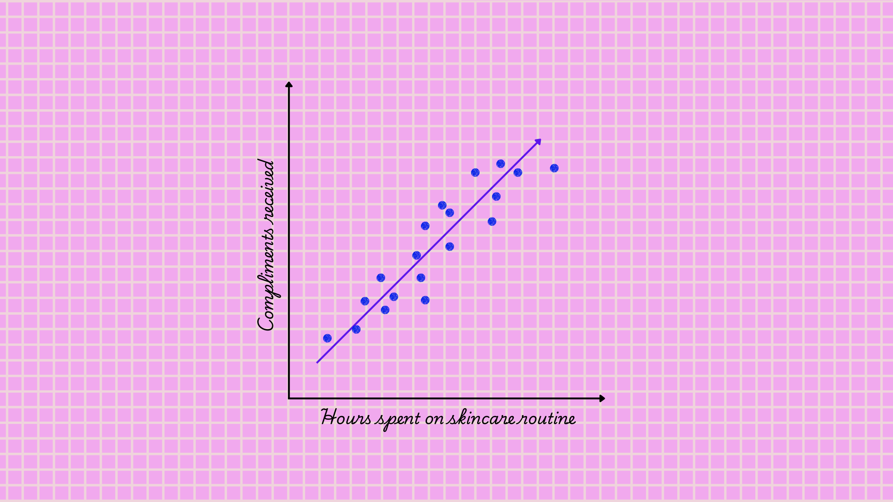
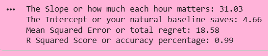
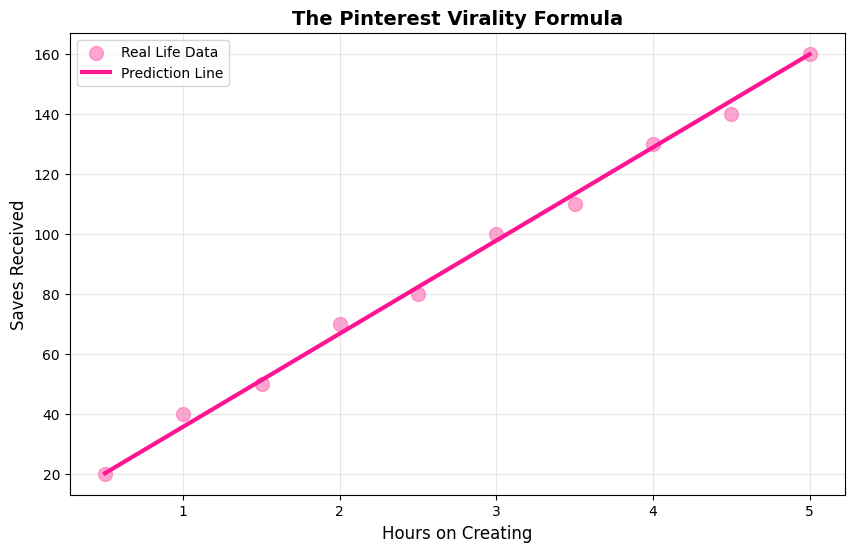
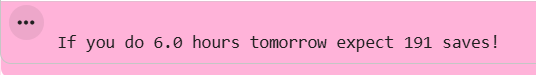

## The episode teaser

You are romanticizing your Sunday afternoon, working with some clay to make those cute Pinterest trinket dishes, fueled by a ridiculously strong dark roast espresso. You notice a pattern. Every single time you post a video of your sketching or clay process, the saves and reposts completely skyrocket. You start wondering if there is an actual formula to this. Can you predict exactly how much love your art will get based on the hours you spend creating it?

Welcome to your newest obsession. You are about to build your first prediction model. Simple Linear Regression is about to be your new favorite tool for your it girl devs journey. She finds the straight line relationship hidden inside messy data. She is that one organized friend who can spot a clear pattern in pure chaos. She is going to help you predict exactly what will happen based on one single input. No drama and pure logic. Let us get right into it.

## The mood board



The line doesn't touch every point because life isn't perfect, but it shows the TREND, and that's what matters.

## Decoding the pattern

Okay let us spill the technical tea like we are dropping voice notes in the group chat.

Simple Linear Regression is basically just figuring out how two things relate to each other. You have your one input which is the independent variable. Let us call her X. In our current art era, X is the hours you spend smoothing out that clay or perfecting your sketches.

Then you have your one output which is the dependent variable. We can call her Y. She is called dependent because she depends completely on X. For us, Y is the amount of saves your aesthetic reel gets.

The whole goal here is to draw the absolute best straight line directly through all your data points. Once you have that perfect line you can predict exactly how much love your next project will get before you even post it.

The math behind this is actually so cute and simple. The equation looks like this:

$$
Y=mX+b
$$

Or if we want to sound super official in our ML era:

$$
y=β_1x+β_0
$$

Let us translate what these letters actually mean for our art project.

- *y* is your predicted outcome. This is the total number of saves your aesthetic reel is going to get.
- *x* is your input feature. This is the exact number of hours you spent crafting your clay and filming the process.
- *β₁* or *m* is the slope (your engagement boost). For every extra hour you spend perfecting your art, how many extra saves do you get. It shows exactly how your hard work pays off.
- *β₀* or *b* is the intercept. This is your baseline aesthetic. Even if you spent zero extra hours planning and just posted a quick unedited clip of your messy desk, this is the guaranteed love your supportive mutuals will show you anyway.

### How does she find this line?

How does our algorithm actually find this perfect line. Here is where the tea gets extra hot. She does not just guess once. She tries out multiple different lines and picks the exact one that minimizes something called the Cost Function. You will also hear this called Mean Squared Error or MSE.

The cost function is your total regret level. It measures exactly how far off your prediction was from reality. When you expect a massive wave of saves on your clay sculpting video but get totally different numbers that gap is your error.

The formula for MSE looks like this:

$$
MSE = \frac{1}{n} \sum_{i=1}^{n} (y_i - \hat{y}_i)^2
$$

Let us translate the variables.

- $y_i$  is your actual value. This is the real amount of saves your aesthetic reel actually got.
- $\hat{y}_i$ is the predicted value. This is what your model thought you were going to get.
- *n* is the total number of data points or the total number of posts you made.

You might be wondering why we square the errors. If we did not do that, the negative differences would just cancel out the positive ones. We are completely skipping that toxic behavior because every single error matters whether it was too high or too low.

To fix these errors, the algorithm uses something called Gradient Descent. It is as an incredibly smart trial and error strategy. She keeps adjusting the slope and the baseline until that MSE is as tiny as possible. She does all the heavy math work so you can just focus on creating your beautiful art.

### The assumptions (Yes, she has standards)

Simple Linear Regression has a few strict rules before she agrees to help you predict your aesthetic reel saves. She is a true girls girl but she needs your data to follow some basic logic before she puts in the work.

1. First is Linearity. The relationship between your clay crafting hours and your engagement needs to be somewhat straight. Putting in more effort should generally result in more love from your supportive mutuals.
2. Second is Independence. Every single video you post has to be its own unique moment. You cannot just upload the exact same sketching process twice and expect the algorithm to treat them as brand new separate events.
3. Third is Homoscedasticity. Please forgive the massive textbook word. It just means the scatter of your data should be consistent. The difference between your expected saves and actual saves should stay within a normal range instead of being wildly unpredictable.
4. Finally we have Normality. Your hits and misses should balance out naturally. Most of your predictions will be super close to reality with only a rare few, completely missing the mark.

If your data completely ignores these rules, she simply will not work. Trying to force it is like putting a heavy facial oil right over your dewy sunscreen. It is just going to pill and make a huge mess. We do not force things that do not blend. We just find a better model.

## [The Code](https://colab.research.google.com/drive/1aF03ygzHi8VA-8USnvkV6hMkt2Mrop26?usp=sharing)

Time to actually write the code and make this real. We are taking the exact logic we just talked about and putting it straight into Python. It is incredibly satisfying to watch the algorithm learn your specific creative patterns.

```python
# Let us predict how many saves your aesthetic reel gets based on creation time
# Importing our it girl toolkit
import numpy as np
import matplotlib.pyplot as plt
from sklearn.linear_model import LinearRegression
from sklearn.model_selection import train_test_split
from sklearn.metrics import mean_squared_error, r2_score

# Our real life data
# Hours spent on clay sculpting and filming per post
clay_hours = np.array([0.5, 1.0, 1.5, 2.0, 2.5, 3.0, 3.5, 4.0, 4.5, 5.0]).reshape(10, 1)

# Saves received on that specific reel
# Tracking everything because we love data
reel_saves = np.array([20, 40, 50, 70, 80, 100, 110, 130, 140, 160])

# Splitting our data because we need a test group
# 80 percent for training our model and 20 percent for testing her predictions
hours_train, hours_test, saves_train, saves_test = train_test_split(
    clay_hours, 
    reel_saves, 
    test_size=0.2, 
    random_state=42  # this number keeps results completely organized
)

# Creating our prediction bestie
bestie_bot = LinearRegression()

# Teaching her the pattern so she can learn your aesthetic
bestie_bot.fit(hours_train, saves_train)

# Making predictions on our test data
predicted_saves = bestie_bot.predict(hours_test)

# Checking her accuracy to see if she is getting it right
mse = mean_squared_error(saves_test, predicted_saves)
r2 = r2_score(saves_test, predicted_saves)

print(f"The Slope or how much each hour matters: {bestie_bot.coef_[0]:.2f}")
print(f"The Intercept or your natural baseline saves: {bestie_bot.intercept_:.2f}")
print(f"Mean Squared Error or total regret: {mse:.2f}")
print(f"R Squared Score or accuracy percentage: {r2:.2f}")

# Let us visualize this
plt.figure(figsize=(10, 6))
plt.scatter(clay_hours, reel_saves, color='#FF69B4', s=100, alpha=0.6, label='Real Life Data')
plt.plot(clay_hours, bestie_bot.predict(clay_hours), color='#FF1493', linewidth=3, label='Prediction Line')
plt.xlabel('Hours on Creating', fontsize=12)
plt.ylabel('Saves Received', fontsize=12)
plt.title('The Pinterest Virality Formula', fontsize=14, fontweight='bold')
plt.legend()
plt.grid(alpha=0.3)
plt.show()

# Future prediction what happens if I spend 6 hours tomorrow
future_routine = np.array([[6.0]])
future_saves = bestie_bot.predict(future_routine)
print(f"\nIf you do {future_routine[0][0]} hours tomorrow expect {future_saves[0]:.0f} saves!")
```

### What's happening here?

Let us look at those numbers our algorithm just dropped. The slope is 31.03 which means for every extra hour you spend perfecting your clay details, you are expected to get around 31 more saves. 



Your intercept is 4.66, which is your baseline. Even if you spend practically zero time planning, you still get those supportive saves from your regular mutuals. Your total regret or Mean Squared Error is only 18.58, which is super low. That tells us the model is making really smart guesses.

Now look at that R Squared score of 0.99. This is basically your model telling you she aced the assignment. A perfect score is 1.0 so hitting 0.99 means your prediction line fits your real life data almost perfectly. The math completely backs up your creative process.

Now, the plot itself is literal visual perfection. Those light pink dots are your actual past posts. That bright pink line running straight through them is your algorithm predicting the future. Notice how closely the dots hug the line. That means your aesthetic is super reliable and your engagement grows steadily the more effort you pour into your art.



Then we asked her to predict the future. We told the algorithm you are going to spend 6.0 hours tomorrow sculpting something amazing. She calculated the math and told us to expect exactly 191 saves. You literally just predicted your own Pinterest virality before even touching the clay.



## Mini-Project: "The Latte Factor"

**Your Mission:** We are tracking exactly how much we spend on our daily coffee runs and using code to predict our future budget. Because an organized developer always knows her data.

**Dataset:** You can grab your starter data right here at [https://www.kaggle.com/datasets/anjaliisharmaa/the-latte-factor](https://www.kaggle.com/datasets/anjaliisharmaa/the-latte-factor). (Or you can just use **pd.read_csv('latte.csv')** and let Pyxie load it for you right here!) It holds ten weeks of cute coffee purchases. X is the amount of cups per week and Y is the total money spent.

**Goal:** Build a linear regression model and answer:

1. What's your predicted spending if you buy 15 cups next week?
2. What's the slope? (How much does each cup increase your spending?)
3. Plot it and make it CUTE (pink theme mandatory)

**Deliverable:** You will create one clean Python script and one beautiful plot. Bonus points if analyzing your own data inspires you to start romanticizing making your dark roast at home.