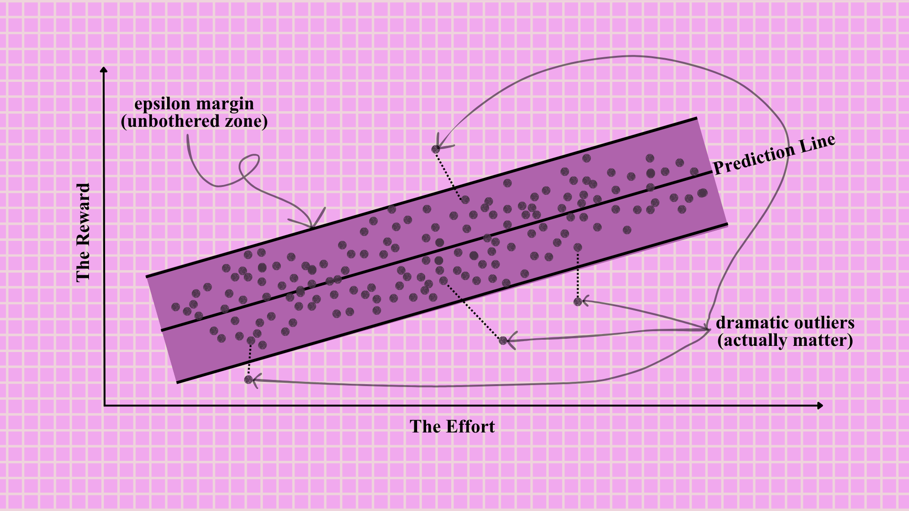
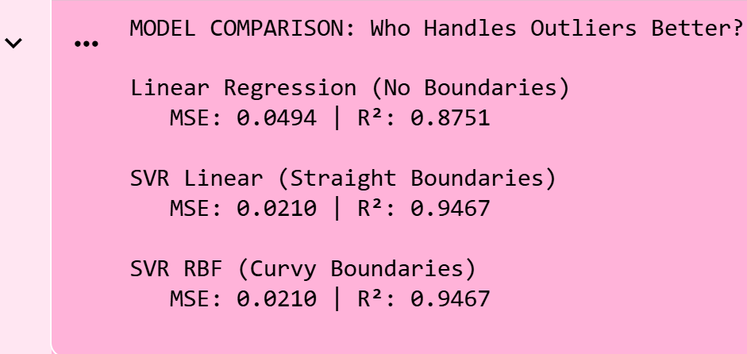
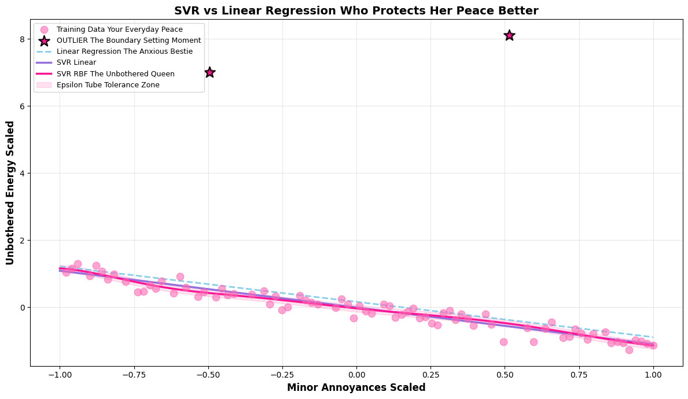
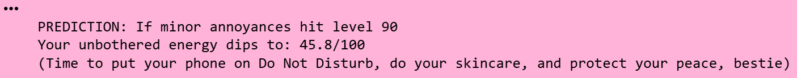

## The episode teaser

You know that one friend who refuses to let every little piece of drama ruin her peace. She only reacts when things cross a very specific boundary. Otherwise, she is just thriving, moisturized, and staying completely in her own lane. That is Support Vector Regression for you.

Unlike Linear Regression, who stresses over every single data point and lets outliers ruin her mood, SVR is selective. She creates an acceptable error zone around her prediction line called the epsilon tube. She only bothers to react when data points fall outside this safe space.

It is literally the data science equivalent of setting healthy boundaries. If the points are matching your vibe and staying in your zone, we love that for you. But if they start acting weird and crossing those boundaries, that is exactly when she clocks it and handles the situation.

SVR is perfect for messy datasets with crazy outliers, nonlinear relationships, and chaotic energy that would make regular regression completely spiral. She stays focused and only uses the most important data points called support vectors to make her decisions. Less drama and way more peace of mind. 

## The mood board



She only cares about the points that cross her boundaries. Icon behavior!

## Decoding the pattern

Support Vector Regression is the regression sister of Support Vector Machines. SVM is usually busy categorizing things, kind of like sorting your vanity into skincare and makeup. SVR takes that exact same organized energy but uses it to predict continuous numbers instead.

Linear regression tries to accommodate everyone. We absolutely love a caring friend who wants everyone to be happy, but taking on all that stress gets exhausting.

SVR has a completely different philosophy about what deserves her energy. She is entirely fine with small errors. If a data point is slightly off but stays inside her acceptable zone, she simply ignores it and keeps glowing. She only penalizes the points that stray way too far and ruin the vibe.

### The core concept: the epsilon tube

Picture the epsilon tube as your absolute favorite thick lip oil or a heavy layer of dewy sunscreen. It creates a flawless protective barrier around your main prediction line with a width of exactly $2\epsilon$.

Any data point within this tube? Ignored. Zero penalty. The model only cares about points that fall outside this boundary, those are the support vectors that shape the final model.

The actual math behind this vibe check looks like this:

$$
f(x)=w^Tx+b
$$

Where:

- $*w*$ is the weight vector.
- $*b*$ is the intercept. This is your baseline starting point.
- $*x*$ represents your input features. These are the raw materials and details you are working with to create the final look.

### The clean girl balance

Support Vector Regression is all about prioritizing her peace. She basically has three main goals. She wants her protective bubble as wide as possible to protect her energy. She wants the absolute minimum amount of boundary violations. And most importantly, she wants to keep her entire routine effortless and simple.

This balancing act actually has a mathematical formula. It is her personal blueprint for staying entirely unbothered while still getting everything done perfectly.

$$
\text{Minimize: } \frac{1}{2} \|w\|^2 + C \sum_{i=1}^{n} (\xi_i + \xi_i^*)
$$

Let us translate the math into English. That first part with the $w$ is all about keeping things sleek and minimalistic. It is about achieving the maximum aesthetic impact with zero complication.

Those little greek letters $\xi_i$ and $\xi_i^*$ are called the slack variables. In our world these represent exactly how far a data point stepped over your line. It is the literal mathematical measurement of the audacity.

Then we have $C$ which is basically your personal tolerance level for the drama. If your $C$ is high, you are taking absolutely zero disrespect and heavily penalizing every single violation. If your $C$ is low you are letting a few minor things slide. You know that protecting your overall peace is way more important than fighting every single little battle.

### The parameter vanity

Let us talk about the specific settings you can tweak to protect your peace. These are basically the core products in your SVR routine.

**1. Epsilon: the unbothered zone**

This determines exactly how wide your protective bubble is. A large epsilon is like applying a super thick layer of overnight lip mask. You are virtually untouchable and simply do not sweat the small stuff. Your routine stays incredibly simple because very few things actually reach you.

A small epsilon is more like a very lightweight daytime serum. You are definitely going to notice a lot more of what is happening around you. Your boundaries are tighter and your model becomes more complex because you are paying attention to way more data points.

**2. Cost and penalty: the C parameter)**

This is your personal boundary enforcement. It decides exactly how you handle the points that dare to step outside your protective tube.

A very large C means you have a strict zero tolerance policy. Cross the line once and there are consequences. You are setting high standards but constantly watching every single detail can lead to total exhaustion. In data science, we call that overfitting.

A small C means you are in a much more forgiving era. You let things slide and stay incredibly flexible. Sometimes you might be a little too relaxed and miss important details but you are keeping your overall stress levels at an absolute minimum.

**3. The kernel: your decision aesthetic**

This defines the overall shape and style of your boundaries.

The Linear kernel is your sleek slicked back bun. It is completely direct and perfect for situations that are simple and clear.

The RBF kernel is the ultimate flawless bouncy blowout. It is smooth and adaptable to almost any situation. This is your primary choice when the data is messy and nonlinear.

The Polynomial kernel is like a very specific sculpted claw clip updo. It has specific angles and curves designed to fit a very particular vibe when standard styles just will not work.

## [The Code](https://colab.research.google.com/drive/1Nnp5ED0vNt1T_9sIt0ty1nHn4D_Drovp?usp=sharing)

Let us put this entire philosophy into practice. We are building a model that predicts your overall unbothered energy based on the daily minor annoyances of campus life. We will also throw in some massive drama to see exactly how our different models handle the chaos.

Here is the exact blueprint for building your own boundary setting model.

```python
# building the boundary queen
# predicting your unbothered energy based on minor annoyances and dramatic outliers

import numpy as np
import matplotlib.pyplot as plt
from sklearn.svm import SVR
from sklearn.linear_model import LinearRegression
from sklearn.model_selection import train_test_split
from sklearn.preprocessing import StandardScaler
from sklearn.metrics import mean_squared_error, r2_score
from sklearn.preprocessing import RobustScaler

# Creating our dataset because life gets complicated and we need a solid sample size
np.random.seed(42) 

# X is 100 instances of minor inconveniences
minor_annoyances = np.arange(1, 101).reshape(100, 1)

# Y is your unbothered energy score starting at 100 and slowly draining
# We add some random noise because everyday peace naturally fluctuates
unbothered_energy = 100 - (minor_annoyances.flatten() * 0.6) + np.random.normal(0, 5, 100)

# Injecting the dramatic boundary setting moments which act as our outliers
unbothered_energy[25] = 260  # First time you had to stand on business
unbothered_energy[75] = 290  # The ultimate block and delete moment
                             
# Using RobustScaler because she completely ignores the drama while doing her job
scaler_x = RobustScaler()
scaler_y = RobustScaler()

minor_annoyances_scaled = scaler_x.fit_transform(minor_annoyances)
unbothered_energy_scaled = scaler_y.fit_transform(unbothered_energy.reshape(100, 1)).flatten()

# Splitting the data into training and testing sets
X_train, X_test, y_train, y_test = train_test_split(
    minor_annoyances_scaled,
    unbothered_energy_scaled,
    test_size=0.2,
    random_state=42
)

# Creating three models to compare their vibes

# Model 1 Linear Regression the absolute people pleaser who cares about everyone
linear_model = LinearRegression()
linear_model.fit(X_train, y_train)

# Model 2 SVR with linear kernel setting boundaries with very straight lines
svr_linear = SVR(kernel='linear', C=100, epsilon=0.1)
svr_linear.fit(X_train, y_train)

# Model 3 SVR with RBF kernel the adaptable queen who protects her peace
svr_rbf = SVR(kernel='rbf', C=100, epsilon=0.1, gamma='scale')
svr_rbf.fit(X_train, y_train)

# Making our predictions
y_pred_linear = linear_model.predict(X_test)
y_pred_svr_linear = svr_linear.predict(X_test)
y_pred_svr_rbf = svr_rbf.predict(X_test)

# Evaluating who handled the drama best
print("MODEL COMPARISON Who Handles Outliers Better\n")

models = {
    "Linear Regression No Boundaries": y_pred_linear,
    "SVR Linear Straight Boundaries": y_pred_svr_linear,
    "SVR RBF Curvy Boundaries": y_pred_svr_rbf
}

for name, preds in models.items():
    mse = mean_squared_error(y_test, preds)
    r2 = r2_score(y_test, preds)
    print(f"{name}")
    print(f"   MSE {mse:.4f} | R² {r2:.4f}\n")
    
# Visualization the ultimate showdown
# Creating a smooth line for plotting
X_plot = np.linspace(minor_annoyances_scaled.min(), minor_annoyances_scaled.max(), 200).reshape(200, 1)
y_plot_linear = linear_model.predict(X_plot)
y_plot_svr_linear = svr_linear.predict(X_plot)
y_plot_svr_rbf = svr_rbf.predict(X_plot)

plt.figure(figsize=(12, 7))

# Plotting our training data
plt.scatter(X_train, y_train, color='#FF69B4', s=80, alpha=0.6, 
            label='Training Data Your Everyday Peace', zorder=3)

# Plotting the outlier specifically
outlier_mask = y_train > 2  
plt.scatter(X_train[outlier_mask], y_train[outlier_mask], 
            color='#FF1493', s=200, marker='*', 
            label='OUTLIER The Boundary Setting Moment', zorder=4, edgecolors='black', linewidth=1.5)

# Plotting all three models
plt.plot(X_plot, y_plot_linear, color='#87CEEB', linewidth=2, 
         label='Linear Regression The Anxious Bestie', linestyle='--') # Python syntax requires the double dash here for the line style
plt.plot(X_plot, y_plot_svr_linear, color='#9370DB', linewidth=2.5, 
         label='SVR Linear')
plt.plot(X_plot, y_plot_svr_rbf, color='#FF1493', linewidth=2.5, 
         label='SVR RBF The Unbothered Queen')

# Showing the epsilon tube for SVR RBF
epsilon = 0.1
plt.fill_between(X_plot.flatten(), 
                 y_plot_svr_rbf - epsilon, 
                 y_plot_svr_rbf + epsilon,
                 alpha=0.2, color='#FF69B4', 
                 label='Epsilon Tube Tolerance Zone')

plt.xlabel('Minor Annoyances Scaled', fontsize=12, fontweight='bold')
plt.ylabel('Unbothered Energy Scaled', fontsize=12, fontweight='bold')
plt.title('SVR vs Linear Regression Who Protects Her Peace Better', 
          fontsize=14, fontweight='bold')
plt.legend(loc='best', fontsize=9)
plt.grid(alpha=0.3)
plt.tight_layout()
plt.show()

# Key insight printer
print("\nTHE TEA")
print("Notice how Linear Regression lets one toxic data point drag her entire mood down")
print("SVR says that does not align with my peace and stays completely unbothered")
print("Quick note on the graph If you are wondering why our huge outliers look smaller on the axis")
print("We had to scale the data so the SVR model could do her job flawlessly")
print("The 290 energy spike is still there she is just wearing a scaled down outfit")
print("The math is absolutely mathing and this is exactly why SVR is the ultimate girls girl for messy real world data")

# future prediction what if the minor annoyances pile up
future_annoyance = np.array([[90]])
future_annoyance_scaled = scaler_x.transform(future_annoyance)
future_energy_svr = svr_rbf.predict(future_annoyance_scaled)
future_energy_actual = scaler_y.inverse_transform(future_energy_svr.reshape(1, 1))

print(f"\nPREDICTION If minor annoyances hit level 90")
print(f"Your unbothered energy dips to {future_energy_actual[0][0]:.1f} out of 100")
print("Time to put your phone on Do Not Disturb do your skincare and protect your peace bestie")
```

### What's happening here?

**1. The math check**

The numbers are speaking for themselves. Linear regression is really struggling out here with low accuracy and high error rates. She let those two massive dramatic moments completely ruin her entire calculation. We all have that one anxious bestie who overthinks the drama and lets it drain her energy. We love her but that approach is totally exhausting.



But look at our SVR models. Both the linear and RBF versions absolutely crushed the assignment with incredibly high accuracy. They saw the massive drama spikes and completely ignored them to protect their peace. They proved mathematically that having strict boundaries actually works.

**2. The visual evidence**

This graph is absolute perfection. Take a look at those giant star points. Those represent your massive boundary setting moments where you really had to stand your ground.



Notice how the line for linear regression gets completely dragged upwards toward the chaos. She totally lost the plot. She let a couple of dramatic moments pull her entirely off track.

Now look at the hot pink line for SVR RBF. She stayed perfectly grounded. She gracefully curves right through your actual everyday peace and completely ignores those massive spikes. She literally looked at the drama and said no thank you. And that light pink shaded area around her? That is her epsilon tube, which is her official tolerance zone. Any minor drama happening inside that zone is just background noise and she does not even react to it. 

**3. The future prediction**

We asked our winning model to predict the future. What actually happens if those daily minor annoyances pile up to level 90.



The model mathematically proves that your peace will drop to critically low levels. The algorithm has spoken: it is time to put your phone on DND, do a face mask, and protect your energy.

## Mini-Project: "The Salary Negotiation Outlier Handler"

**Your mission**

You are a tech career coach analyzing salary data. Most people follow a normal trend, but some data points are totally wild. We are talking about early founders with massive stock options or people who got a huge lottery win level signing bonus. These are called **Outliers**. If you use a basic model, these wild points will ruin your data. Your goal is to build an SVR model that handles these outliers like a pro.
Grab the 200-row salary dataset: [**The Salary Negotiation Outlier Handler**](https://www.kaggle.com/datasets/anjaliisharmaa/the-salary-negotiation-outlier-handler) (Or you can just use **pd.read_csv('salary.csv')** and let Pyxie load it for you right here!) and let the model battle begin! Your mission is to build both Linear Regression and SVR (RBF) models to see who handles wild salary outliers better. Compare their MSE and R² scores across 3 different C and epsilon combos, then write a 3-sentence verdict on which model you’d trust for a real-world salary negotiation.